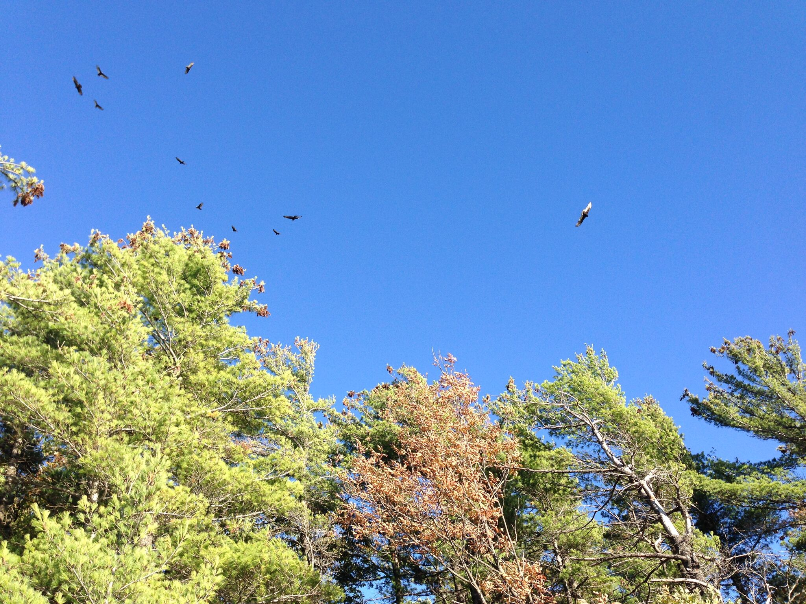

Song Wang’s Homepage
---
### I am now a fourth-year PhD student at Department of Statistics, University of Wisconsin - Madison.

 

#### I am  TA for stat424 -Experiemntal Designs- 2016 Spring, working with Donald Porter. I will post my handouts and code here.   [TA: Song Wang's page for stat424 2016 Spring](Stat424-s16.html)

