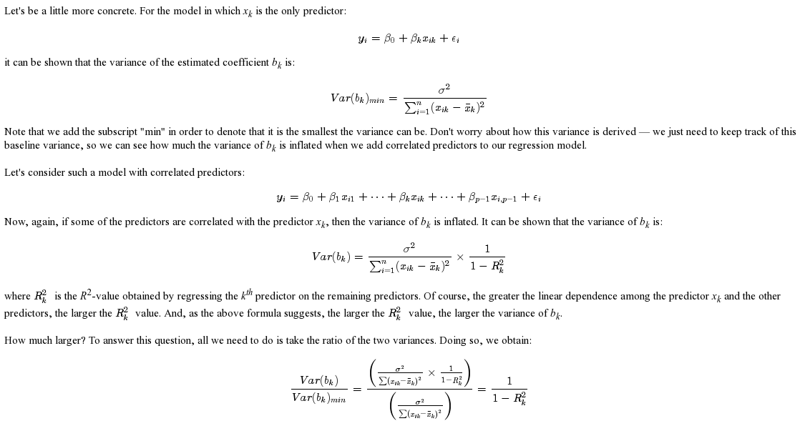

The following data (*bloodpress.txt*) on 20 individuals with high blood pressure
\begin{enumerate}
\item blood pressure (y = BP, in mm Hg)
\item age (x1 = Age, in years)
\item weight (x2 = Weight, in kg)
\item body surface area (x3 = BSA, in sq m)
\item duration of hypertension (x4 = Dur, in years)
\item basal pulse (x5 = Pulse, in beats per minute)
\item stress index (x6 = Stress)
\end{enumerate}

The researchers were interested in determining if a relationship exists between blood pressure and age, weight, body surface area, duration, pulse rate and/or stress level.

```{r}
rm(list=ls())
bloodpress <- read.table("./bloodpress.txt", header = T)
( cor.bp <- round ( cor(bloodpress[,-1]) ,3))
cor.bp *(cor.bp>0.8)
```


###Topic 1 Effects of multicollinearity: 
regress BP on Weight and BSA, check out the changes when a new variable which is correlated to the existing variable is added to the model.

```{r, echo=FALSE}
lm1 <- lm(BP~ Weight, bloodpress)
lm2 <- lm(BP~ BSA, bloodpress)
lm3 <-lm (BP~ Weight+BSA, bloodpress)
lm4 <- lm(BP~ BSA + Weight, bloodpress)

summary(lm1) 
summary(lm2)
summary(lm3)
summary(lm4)
## coefficients changed and standard error of regression coefficients increase when a new variable is added to the model


anova(lm1)
anova(lm2)
anova(lm3)
anova(lm4)
## SS for each variable dependent on what other variables are in the model. the contribution/ importance of one variable is not absolute anymore.
```


###Topic 2, how to detect the multicollinearity -- Variation Inflation Factor.


```{r}

```


